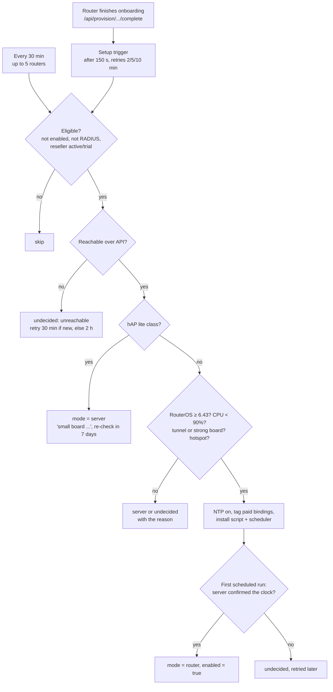

# Expiry enforcement: how expired hotspot customers are removed

Status: live in production since 2026-09-26, fleet-wide since 2026-09-27.

This document explains how an expired hotspot customer loses internet access: who removes them, how fast, how the platform stays in sync with the router, and how new routers are enrolled. It covers hotspot customers only. PPPoE customers are still removed by the server job alone.

## 1. The short version

There are two ways an expired customer is removed:

1. **The router removes them itself** (the "reaper"). Every paid customer's access entry on the router carries their deadline. A small script on the router checks it once a minute, asks the platform whether each due customer should really go, removes them, and reports back. This works even when our management tunnel is down.
2. **The server removes them** (the cleanup job). Every 45 seconds the backend finds expired customers in the database and removes them from their router over the RouterOS API. This only works while the server can reach the router.

Every router uses the server job. Routers that can take the script also use the reaper, and for them the server job becomes a backstop: it waits 3 minutes past expiry before acting, so the router gets there first.

Who gets which method is decided automatically, when a router finishes onboarding and again every 30 minutes (section 6):

| Router | Who removes expired customers |
|---|---|
| hAP lite class (hAP lite / RB941, hAP mini, RB931) | server only (by design, see 7.1) |
| Every other board, reseller active or on trial, not RADIUS | router (reaper), server as backstop |
| Suspended/inactive reseller, RADIUS router | server only |

### Why

Measured on 2026-09-26/27:

| | Median | 95th percentile | Removed within 1 min |
|---|---|---|---|
| Server job, whole fleet, week before | 3.2 min | 118 min | 18% |
| Router reaper (394 removals) | 32 s | 59 s | 97% |

The server-side method has two limits that no amount of tuning removes. First, it has to reach the router at the moment of expiry, and at any given time part of the fleet is unreachable (power cuts, dead tunnels, weak links), so those customers kept internet for minutes or hours. Second, it scales with the fleet: every removal costs a login and table reads from our server. The reaper moves the deadline onto the router, which is how RADIUS-based ISP billing enforces session limits.

## 2. The pieces

```mermaid
flowchart LR
    subgraph Server["Backend (Hetzner)"]
        PAY[Payment / provisioning<br/>writes EXP deadline]
        EP["POST /api/router/expiry-check"]
        JOB[Cleanup job<br/>every 45 s]
        ENROL[Enrolment<br/>at /complete + every 30 min]
        DB[(Postgres)]
    end
    subgraph Router["Customer MikroTik"]
        BIND[ip-binding comment<br/>USER:..|EXP:unix-seconds]
        REAPER[bitwave-expiry-reaper<br/>scheduler, every 1 min]
    end
    PAY -- RouterOS API --> BIND
    REAPER -- reads --> BIND
    REAPER -- "HTTP over tunnel (HTTPS fallback)<br/>due / done lists" --> EP
    EP -- "R remove / K keep / X forget" --> REAPER
    EP --> DB
    JOB -- "RouterOS API<br/>(3-min grace on reaper routers)" --> BIND
    JOB --> DB
    ENROL -- "classify board, install script" --> REAPER
    ENROL --> DB
```

| Piece | Where |
|---|---|
| Deadline tag, request/reply format, decisions | `app/services/router_expiry.py` |
| The RouterOS script (rendered per router) | `app/services/expiry_reaper_script.py` |
| Router-facing endpoint | `app/api/router_expiry_routes.py` (`POST /api/router/expiry-check`) |
| Deadline written at payment | `mikrotik_api.add_customer_bypass_mode(..., expiry=)`, called from `hotspot_provisioning` |
| Server cleanup job and 3-min grace | `app/services/mikrotik_background.py` (`cleanup_expired_users_background`, `EXPIRY_REAPER_GRACE`) |
| Safety-net scan + credential reaper (own job) | `mikrotik_background.expiry_housekeeping_background` |
| Automatic enrolment | `app/services/expiry_reaper_enrol.py`; hooked into `app/api/provisioning.py` (`/complete`) and `main.py` (30-min job) |
| Manual install / removal / dry run | `scripts/expiry_reaper_install.py` |
| Removal-speed report | `scripts/expiry_removal_report.py` |
| Tests | `tests/test_router_expiry_reaper.py`, `tests/test_expiry_reaper_enrol.py`, `tests/test_expiry_cleanup_speed.py` |

Router columns (`routers` table, added by idempotent startup migrations in `main.py`):

| Column | Meaning |
|---|---|
| `expiry_reaper_enabled` | The router runs the reaper; the server job waits 3 min past expiry before acting |
| `expiry_reaper_installed_at` | When the reaper was (last) installed |
| `expiry_reaper_mode` | `router`, `server`, or NULL (not decided yet) |
| `expiry_reaper_reason` | Why, e.g. `installed`, `small board hAP lite`, `no tunnel route (...)`, `unreachable` |
| `expiry_reaper_checked_at` | When the enrolment last looked at the router |

## 3. The deadline on the router

When a payment is delivered, the customer's `/ip hotspot ip-binding` (type `bypassed`, which is what gives access) gets this comment:

```
USER:AABBCC000001|EXPIRES:DB_MANAGED|EXP:1790503452|2026-09-27 10:22:56
```

`EXP:` is the expiry as a **unix timestamp in seconds, UTC, rounded up**. It is a plain integer, so RouterOS 6 and 7 can compare it without date parsing. The older fields (`USER:`, `EXPIRES:DB_MANAGED`) are kept because other code matches on them. The first pilot installs wrote unix minutes; any value below 1,000,000,000 is read as minutes by both the script and the server.

A renewal delivered to the router rewrites the tag. A renewal that could not be delivered is handled by the `K` reply (section 4).

**Expiry extended without a payment.** Outage compensation, an admin editing the expiry, and device pairing change the database only. The tag is then earlier than the paid expiry. While the router can reach the server that is harmless, because the `K` reply corrects it at the old deadline. With the server unreachable at that moment, though, the router would fall back to the stale tag and remove a paying customer. `app/services/expiry_tag_sync.py` closes this in two layers:
- **straight after the change**: compensation and the admin edit call `schedule_expiry_tag_sync(customer_ids)`, which re-tags those bindings within seconds;
- **every 15 minutes** (job `expiry_tag_reconcile`): every reaper router's bindings are compared with the database, and any tag earlier than the latest paid expiry for that MAC is corrected. This covers the paths that don't call the hook, and routers that were offline when the hook ran.

Both layers only ever move a deadline **later**, and each correction writes an `expiry_tag_resync` provisioning log. Before writing, both the database and the router are read again, so a payment that lands in the meantime (and writes a later tag) is never overwritten with an earlier one. The kill switch is `EXPIRY_TAG_SYNC_ENABLED`. Found on 2026-09-28, when a 6 h compensation on router 141 left six bindings on the old deadline; nobody was removed early.

**PPPoE is not affected.** The reaper only reads hotspot ip-bindings. PPPoE customers are removed by the server job at their database expiry, with no grace period, so a compensation or edit takes effect as soon as it is saved.

Bindings written by other paths (FUP restore, access credentials, public reconnect, shared-subscription devices that log in as hotspot users) carry no `EXP:` tag. The reaper ignores them and the server job removes them as before.

## 4. The protocol: ask before removing, report after

The router never removes anyone on its own authority while it can reach us. It asks first, and only the router's report changes the database.

```mermaid
sequenceDiagram
    participant R as Router (every minute)
    participant S as Server /api/router/expiry-check
    participant D as Database
    R->>R: EXP deadline passed for MAC A and MAC B
    R->>S: ident, now, due=A,B, done=(earlier removals)
    S->>D: look up A and B on this router
    S-->>R: BW1;C=1;R=A,;K=B@1790510000,;X=;
    R->>R: remove A (binding, host, session, user, queue)
    R->>R: set B's EXP to the new deadline (renewed)
    R->>S: next call: done=A@1790503452
    S->>D: A → INACTIVE, hotspot_deactivation log at the router's time
```

**Request** (POST, plain text, bearer token = the router's usage-push token, an HMAC of its identity):

```
ident=Router-1211&now=1790503500&due=AA:BB:CC:00:00:01,&done=AA:BB:CC:00:00:02@1790503452,
```

- `now`: the router's clock as a unix time, so the server can check it.
- `due`: MACs whose deadline has passed.
- `done`: MACs the router removed, with the second it removed them.

**Reply**:

```
BW1;C=1;R=<MAC>,...;K=<MAC>@<new deadline>,...;X=<MAC>,...;
```

| Part | Meaning |
|---|---|
| `C=1` / `C=0` | Router clock is / is not within 5 minutes of ours |
| `R` | Still expired in the database: remove |
| `K` | Renewed: keep, and here is the new deadline |
| `X` | No customer of ours has this MAC: stop asking (tag renamed to `EXX:`) |

Decisions are per MAC, because one MAC can have several customer rows on a router (abandoned STK payments leave phantom rows). If any row for that MAC is active with a future expiry, the answer is keep.

**What a `done` report does** (only this changes the database):

- The customer becomes `INACTIVE`.
- A `hotspot_deactivation` / `success` row goes into `provisioning_logs` with details `Router expiry reaper removed hotspot access` and `log_date` = the router's removal second (when its clock is trusted).
- The expiry SMS is queued after the commit, as with the server job.
- If the customer renewed in the meantime, access is **restored** (re-provisioned) instead, and the log line shows `repaired=1`.

**Endpoint guards**: same 401 for every auth failure, one call per router per 20 s (429), and 503 + `Retry-After` when the DB pool is under pressure. The router simply asks again later. One short DB session per call; re-provisioning and SMS run as background tasks after the commit.

## 5. The script on the router

`bitwave-expiry-reaper`: one script plus a scheduler that runs it every minute. State lives in globals named `bwExp*`.

**Each run:**

1. Work out the current unix time from `/system clock` using integer maths only. It handles both date formats (`sep/26/2026` before RouterOS 7.10, `2026-09-26` after) and both `gmt-offset` forms. There's no `:totime` / `:timestamp`, which RouterOS 6 lacks.
2. If the year is not plausible (2025–2045), do nothing at all. A hAP lite has no battery clock and boots in 1970 until NTP syncs.
3. Walk the tagged bindings only when needed: a deadline has passed, the number of bindings changed, a report is pending, or at most every 5 minutes. A quiet minute costs a clock read and a binding count.
4. Call the server only when something is due, a removal needs reporting, or once an hour as a heartbeat. It tries plain HTTP inside the management tunnel first (`http://10.251.0.1:8088/...`, served by Caddy on the tunnel address), then public HTTPS. On a hAP lite, HTTPS costs 5–7 s of full CPU; the tunnel call costs 1–2 s.
5. Act on the reply: remove `R` (binding, active session, host, hotspot user, `plan_` queue), update `K` deadlines, mark `X` as `EXX:`. Queue each removal for the next report.

**When the server can't be reached**, the router waits 5 minutes before calling again. Meanwhile it removes customers past their own deadline, **but only if the server confirmed its clock since the router last booted** (`bwExpClockOk`). If the server says the clock is wrong, the router checks in again after 5 minutes instead of an hour. Globals don't survive a reboot, so after a power cut the router always needs a fresh server confirmation before acting on its own.

The script has no bare `:return` and no `:toarray`. RouterOS 7.19+ rejects a whole script over one bare `:return`, which is what broke the old router agent.

## 6. Enrolment: which routers get the reaper



Two triggers, one piece of logic (`_enrol` in `expiry_reaper_enrol.py`):

- **At onboarding**: `/complete` (and `POST /api/routers/create` for routers added by hand) schedules a background task. It starts 150 s later, so the router's tunnel comes up and the real-time push installer (started by the same callback) goes first. It retries at 2, 5 and 10 minutes while the result is undecided. A new router is usually decided within a few minutes of setup.
- **Every 30 minutes**: the catch-all, up to 5 routers per run. It picks up routers the setup trigger missed, routers back online, reactivated resellers, and fixed tunnels.

The two never work on the same router at once (`_in_flight`).

**Checks, in order**: identity matches the database; not the hAP lite class (board name or RouterBOARD model); RouterOS 6.43+; CPU below 90%; hotspot binding table present. Older 64 MB boards (RB951, RB750, hEX lite, mAP) must also reach the tunnel. That's tested with a ping, then a real HTTP call, because lossy links drop pings (router 537). Bigger boards may use HTTPS.

**When a router is looked at again:**

| Reason | Re-check after |
|---|---|
| hAP lite class, RADIUS, RouterOS too old, scheduler refused (device-mode "configuration flagged", needs a button press on site) | 7 days |
| No tunnel route, no hotspot table (fixable remotely) | 24 hours |
| Unreachable, busy, clock not confirmed yet | 30 min for routers added in the last 48 h, else 2 hours |

The reaper flag is set **only after** the script's first scheduled run gets a clock confirmation from the server, so a router whose script can't reach us never gets the 3-minute server grace.

**Switches** (`app/config.py`): `EXPIRY_REAPER_AUTO_ENROL` (default on; set false to pause both triggers) and `EXPIRY_REAPER_ENROL_BATCH` (5).

## 7. Design decisions and failure modes

### 7.1 Why hAP lites stay on server-side removal

On 2026-09-26, hAP lites 371 and 483 were pinned at 100% CPU with 5–7 MB free and refused API logins. Our script was a small share of the load. The problem was the stack of Bitwave schedulers on a 32 MB board: usage push, check-in, tunnel watchdog, the old command agent (which writes a file to flash every 2 minutes) and the reaper. When the reaper briefly ran on hAP lites it removed customers in a median of 36 s, so the method works there; the boards just have no headroom. To bring them back, free CPU on them first (retire the old command agent, slim the reporting), then flip the classification rule.

### 7.2 Clock safety

A router with a wrong clock could cut paying customers. Guards: the plausible-year check; the server compares the router's clock with ours on every call (±5 min); offline enforcement only with a clock confirmed since boot; enrolment turns on NTP and only enables the reaper after a confirmation. In the first days this caught several power-cut reboots (218, 390, 378, 118, 316 among them). Each time the router waited for NTP, got confirmed, and cleared its backlog.

### 7.3 Keeping the database in sync

- **Only the router's `done` report changes the database.** The router asks before it removes, so the answer is based on the database at that moment.
- **Renewal race:** the customer paid after the router removed them offline. The report triggers a re-provision instead of a deactivation.
- **Reboot between removing and reporting:** the pending report is lost with the globals. The customer has no access (enforcement happened), but the database still shows them active. After the 3-minute grace the server job finds nothing left to remove and records the deactivation, labelled as the server job and later. This makes router figures look slower, never faster.
- **Server restarts** (deploys): calls during the restart fail, the router backs off 5 minutes and keeps enforcing locally, and the backstop may record some removals. Seen on 2026-09-26 during two deploys.

### 7.4 The server job after PR #100

Removals used to pause for 5–6 minutes out of every 10, while the fleet-wide safety-net scan ran inside the removal job. Each customer also cost about 10 full router-table downloads. Now:
- the removal job runs every 45 s in its own lane (4 routers at once, own thread pool);
- it reads each router's tables once per run;
- it handles up to 150 customers per run and 30 per router;
- the safety-net scan and credential reaper are a separate job.

On reaper routers it waits `EXPIRY_REAPER_GRACE` (3 min) past expiry before acting.

## 8. Measuring

Every removal is in `provisioning_logs` (`action = 'hotspot_deactivation'`, `status = 'success'`). The `details` column says who did it: `Router expiry reaper removed hotspot access` for the router, anything else for the server. Time to removal = `log_date - customers.expiry`.

```bash
# per router and method: median / p90 / p95 / max and share within 30 s, 1, 2, 5, 10 min
ssh -o BatchMode=yes root@91.98.238.12 "docker exec -e ROUTER_IDS=10,224 -e HOURS=24 -e BEFORE=1 -i isp_billing_hetzner_app python -" < scripts/expiry_removal_report.py
```

```sql
-- where every router stands
SELECT coalesce(expiry_reaper_mode, 'undecided'), expiry_reaper_reason, count(*)
FROM routers GROUP BY 1, 2 ORDER BY 1, 3 DESC;
```

Logs: `[EXPIRY-REAPER]` lines per call (clock state, due/remove/keep/forget/confirmed/repaired counts) and `[REAPER-ENROL]` per enrolment run.

## 9. Operations

| Task | How |
|---|---|
| Pause automatic enrolment | `EXPIRY_REAPER_AUTO_ENROL=false` in the server env, restart the app |
| Enrol one router now | `docker exec -e ROUTER_IDS=<id> -e APPLY=1 -i isp_billing_hetzner_app python - < scripts/expiry_reaper_install.py` (dry run without `APPLY`) |
| Remove the reaper from a router | the same with `-e UNINSTALL=1 -e APPLY=1`; removes script, scheduler and globals, clears the flag. `EXP:` tags stay (nothing reads them) |
| Check a router's script state | `/system script environment print` on the router: `bwExpClockOk`, `bwExpBeat`, `bwExpRetryAt`, `bwExpDone` |
| Router removes but DB lags | pending `bwExpDone` not reported yet (backoff); the backstop closes it after 3 min |

Known exceptions (2026-09-28):
- **131 Major1 Net #1**: RouterOS device-mode "configuration flagged" refuses scheduler adds; needs a physical button press.
- **351 HOME951 and 448 RONGAI**: their direct Hetzner WireGuard (`wg-hz`) has not handshaken since 2026-09-25 (two routers behind one public IP, same source port). 448 uses the reaper over HTTPS; 351 stays on the server job until the tunnel is fixed.

## 10. History

| Date | Change |
|---|---|
| 2026-09-25 | Removal speed measured: 20% within 1 min fleet-wide |
| 2026-09-26 | #103 reaper protocol and endpoint; pilot on 10, 224, 316, 381. #108 removal time in seconds. #110 deadlines in seconds. #119 clock re-check after reboot + batch installer. Rollout to 54 routers; hAP lites removed |
| 2026-09-26 | #100 server job: no safety-net stall, one table read per router, own lane. #123 installer guards |
| 2026-09-27 | #128 automatic enrolment (on by default), fleet sweep → 59 routers |
| 2026-09-28 | Enrolment at onboarding (`/complete`), re-check windows by reason and router age |
| 2026-09-28 | Expiry tag sync: a tag is moved later when compensation or an admin edit extends the expiry, plus a 15-min reconcile |
